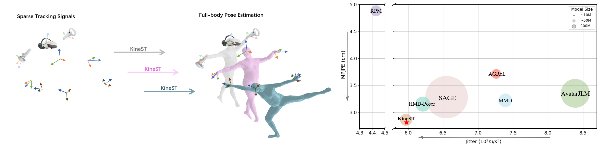

# KineST: A Kinematics-guided Spatiotemporal State Space Model for Human Motion Tracking from Sparse Signals

> **Shuting Zhao, Zeyu Xiao, Xinrong Chen**
> AAAI 2026

[[`arXiv`](https://arxiv.org/abs/2512.16791)] [[`Page`](https://kaka-1314.github.io/KineST/)] 

<p align="center">  </p>

## Enviroment Setup
All our experiments are done on a single 4090 24G GPU.
```
conda env create -f environment.yml
conda activate KineST
```
The code was tested on Python 3.10 and torch 2.3.1.

Download the [human_body_prior](https://github.com/nghorbani/human_body_prior/tree/master/src) lib and [body_visualizer](https://github.com/nghorbani/body_visualizer/tree/master/src) lib and put them in this repo. The repo should look like
```
KineST
├── body_visualizer
├──── mesh/
├──── tools/
├──── ...
├── human_body_prior/
├──── body_model/
├──── data/
├──── ...
├── dataset/
├── prepare_data/
└── ...
```

## Dataset Preparation
Please download the AMASS dataset from [here](https://amass.is.tue.mpg.de/)(SMPL+H G).
```
python prepare_data.py --support_dir /path/to/your/smplh/dmpls --save_dir ./dataset/AMASS/ --root_dir /path/to/your/amass/dataset
```
The generated dataset should look like this
```
./dataset/AMASS/
├── BioMotionLab_NTroje
├──── train/
├──── test/
├── CMU/
├──── train/
├──── test/
└── MPI_HDM05/
├──── train/
└──── test/
```

## Evaluation 需要修改
You can either download our pre-trained models or use your pre-trained model.
To download our pre-trained models:
```
sh prepare_data/download_model.sh
```

To evaluate the model:
```
python test.py --model_path /path/to/your/model --support_dir /path/to/your/smpls/dmpls --dataset_path ./dataset/AMASS/
```

## Training
To train the model:
```
python train.py --save_dir o/path/to/save/your/model --dataset amass --weight_decay 1e-5 --batch_size 256 --lr 3e-4 --latent_dim 512 --save_interval 1 --log_interval 1  --input_motion_length 96 --num_workers 8 --motion_nfeat 132 --arch mlp_PureMLP --layers 12 --sparse_dim 54 --lr_anneal_steps 200000 --overwrite --no_normalization
```

## Pretrained Weights 需要修改
The pretrained weights for AGRoL can be downloaded from this link: https://github.com/facebookresearch/AGRoL/releases/tag/v0

To download the wights automatically, please run `bash prepare_data/download_model.sh`.

To test the pretrained AGRoL diffusion-model:
```
python test.py --model_path pretrained_weights/diffmlp.pt --timestep_respacing ddim5 --support_dir /path/to/your/smpls/dmpls --dataset_path ./dataset/AMASS/
```

To visualize the generated motions, add these commands behind:
```
--vis --output_dir /path/to/save/your/videos
```


## Acknowledgements
This project is built on source codes shared
by [body_visualizer](https://github.com/nghorbani/body_visualizer/tree/master/src/body_visualizer),
[human_body_prior](https://github.com/nghorbani/human_body_prior/tree/master/src/human_body_prior),
[AvatarPoser](https://github.com/eth-siplab/AvatarPoser), [AGRoL](https://github.com/facebookresearch/AGRoL),
[BoDiffusion](https://github.com/BCV-Uniandes/BoDiffusion).
We thank the authors for their great job!


## <a name="CitingKineST"></a> Citing KineST
If you find our work inspiring or use our codebase in your research, please consider giving a star ⭐ and a citation.
```bibtex
@article{zhao2025kinest,
  title={KineST: A Kinematics-guided Spatiotemporal State Space Model for Human Motion Tracking from Sparse Signals},
  author={Zhao, Shuting and Xiao, Zeyu and Chen, Xinrong},
  journal={arXiv preprint arXiv:2512.16791},
  year={2025}
}
```

